# Lab: Xây Dựng Hệ Thống Giám Sát Log Tập Trung Với ELK Stack

## 1. Mục tiêu và Phạm vi

Tài liệu này hướng dẫn chi tiết cách triển khai một lab ELK Stack đóng vai trò hệ thống lưu trữ và phân tích log tập trung (SIEM cơ bản) cho một mạng doanh nghiệp giả lập.

Sau khi hoàn thành lab, bạn sẽ:

- Hiểu kiến trúc tổng thể của hệ thống giám sát log trong mạng doanh nghiệp.
- Cài đặt và cấu hình đầy đủ ELK Stack (Elasticsearch, Logstash, Kibana).
- Cấu hình pfSense gửi log tường lửa về ELK.
- Cấu hình Suricata IDS/IPS + Filebeat để đẩy log cảnh báo tấn công.
- Cấu hình Winlogbeat để thu thập Event Log Windows (đặc biệt là log đăng nhập).
- Xây dựng Data View, Dashboard trên Kibana để quan sát tấn công brute-force, SQLi, scan Nmap.

---

## 2. Kiến trúc tổng quan

Mô hình lab mô phỏng một mạng doanh nghiệp đơn giản có tích hợp hệ thống giám sát log tập trung.

**Các thành phần chính:**

- **Vùng Internet (External):** Máy Attacker (Kali) mô phỏng hành vi tấn công.
- **Gateway/Firewall:** pfSense làm router/tường lửa, NAT ra Internet và gửi log về ELK.
- **Vùng LAN (Internal):**
  - Domain Controller (WinServer) – Active Directory.
  - Máy trạm domain (WinClient).
  - IDS/IPS Suricata.
  - ELK Server (Elasticsearch, Logstash, Kibana).

Luồng log tổng quát:

> [pfSense / Suricata / Windows] → [Filebeat / Winlogbeat / Syslog] → [Logstash] → [Elasticsearch] → [Kibana]

---

## 3. Quy hoạch mạng và máy ảo

### 3.1. Virtual Network

Sử dụng hypervisor (VMware/VirtualBox/Proxmox) với 2 mạng ảo:

| Mạng ảo | Subnet | Chức năng |
| :--- | :--- | :--- |
| **VMnet1 (External)** | `192.168.10.0/24` | Mạng Internet (Attacker) |
| **VMnet2 (Internal)** | `192.168.20.0/24` | Mạng LAN doanh nghiệp |

### 3.2. Danh sách máy ảo

| Máy ảo | Hệ điều hành | NIC | IP | Vai trò |
| :--- | :--- | :--- | :--- | :--- |
| **Attacker** | Kali Linux | NAT | `192.168.137.x` | Thực hiện tấn công (Nmap, Hydra, SQLi,...) |
| **pfSense** | pfSense | NIC 1: NAT, NIC 2: VMnet2 | WAN: `192.168.137.133` / LAN: `192.168.20.1` | Router/Firewall, gửi Syslog |
| **IDS/IPS** | Ubuntu/Debian | VMnet2 | `192.168.20.5` | Suricata + Filebeat |
| **WinServer (DC)** | Windows Server | VMnet2 | `192.168.20.10` | Domain Controller + Winlogbeat |
| **WinClient** | Windows 10 | VMnet2 | `192.168.20.15` | Máy trạm join domain |
| **ELK Server** | Ubuntu/Debian Server | VMnet2 | `192.168.20.100` | Elasticsearch, Logstash, Kibana |

**Một số cấu hình mạng minh họa:**

- Cấu hình LAN trên pfSense:

  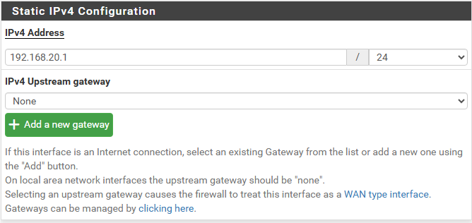

- Cấu hình WAN trên pfSense:

  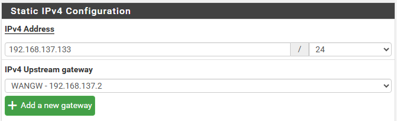

- Cấu hình IP Windows Client:

  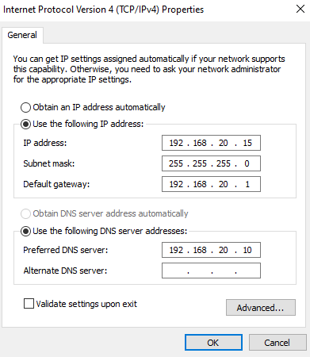

- Cấu hình IP Windows Server (DC):

  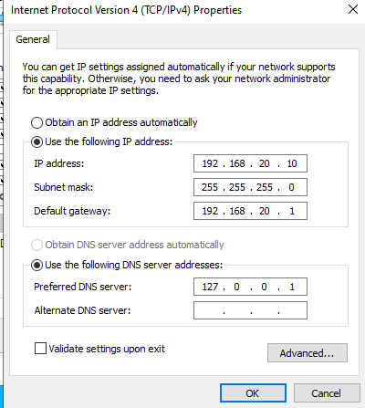

- Cấu hình Netplan cho IDS/IPS:

  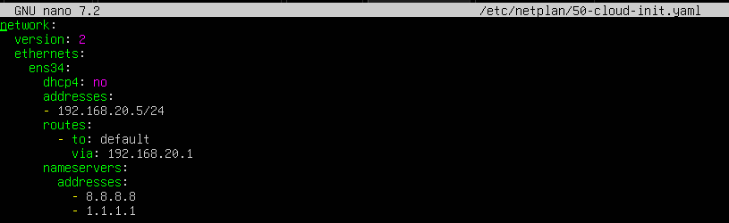

- Cấu hình Netplan cho ELK Server:

  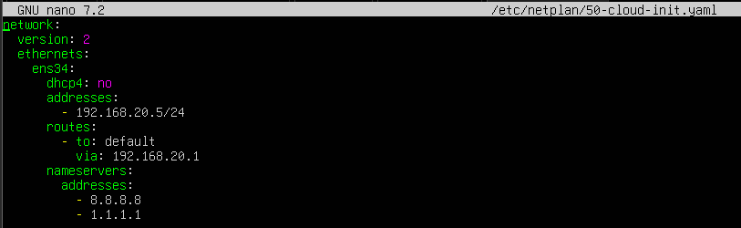

---

## 4. Triển khai ELK Server (192.168.20.100)

### 4.1. Chuẩn bị

Trên Ubuntu/Debian Server:

```bash
sudo apt update && sudo apt upgrade -y
sudo apt install default-jre default-jdk -y
sudo apt install curl apt-transport-https -y

# Thêm repository Elastic 8.x
curl -fsSL https://artifacts.elastic.co/GPG-KEY-elasticsearch | sudo gpg --dearmor -o /usr/share/keyrings/elastic.gpg
echo "deb [signed-by=/usr/share/keyrings/elastic.gpg] https://artifacts.elastic.co/packages/8.x/apt stable main" | sudo tee -a /etc/apt/sources.list

sudo apt update
```

### 4.2. Cài đặt và cấu hình Elasticsearch

```bash
sudo apt install elasticsearch -y
```

Chỉnh file cấu hình:

```bash
sudo nano /etc/elasticsearch/elasticsearch.yml
```

Các tham số chính:

```yaml
network.host: 192.168.20.100
discovery.type: single-node
xpack.security.http.ssl:
  enabled: false
  keystore.path: certs/http.p12
```

Khởi động dịch vụ:

```bash
sudo systemctl daemon-reload
sudo systemctl enable --now elasticsearch.service
sudo systemctl status elasticsearch.service
```

### 4.3. Cài đặt và cấu hình Kibana

```bash
sudo apt install kibana -y
sudo nano /etc/kibana/kibana.yml
```

Thiết lập tối thiểu:

```yaml
server.port: 5601
server.host: "192.168.20.100"
elasticsearch.hosts: ["http://192.168.20.100:9200"]
```

Khởi động:

```bash
sudo systemctl daemon-reload
sudo systemctl enable --now kibana.service
sudo systemctl status kibana.service
```

Truy cập giao diện Kibana: `http://192.168.20.100:5601` từ máy trong LAN.

Ảnh minh họa giao diện Elastic/Kibana:

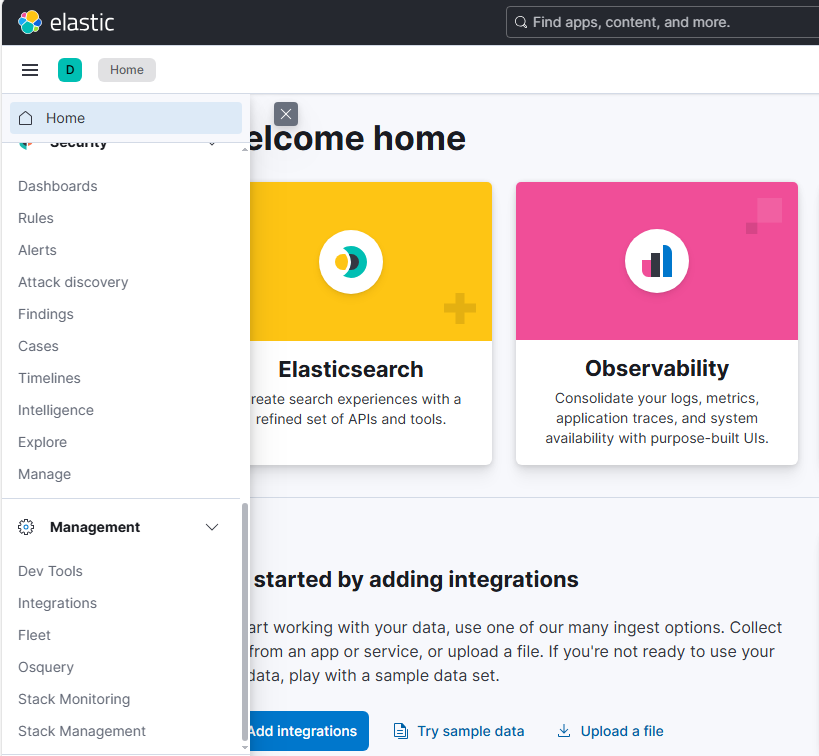

### 4.4. Cài đặt và cấu hình Logstash

```bash
sudo apt install logstash -y
sudo nano /etc/logstash/conf.d/logstash.conf
```

Cấu hình pipeline hoàn chỉnh xử lý riêng log pfSense, Suricata (Filebeat) và Winlogbeat:

```conf
input {
  # 1. Cổng nhận Log từ tường lửa pfSense (Syslog UDP)
  udp {
    port => 5140
    type => "pfsense"
  }

  # 2. Cổng nhận Log từ các máy ảo Ubuntu (Filebeat) và Windows (Winlogbeat)
  beats {
    port => 5044
  }
}

filter {
  # ==========================================
  # PHẦN 1: XỬ LÝ LOG TỪ PFSENSE (UDP 5140)
  # ==========================================
  if [type] == "pfsense" {
    if "filterlog" in [message] {
      grok {
        match => { "message" => ".*filterlog.* - - %{GREEDYDATA:filter_data}" }
      }
      if [filter_data] {
        csv {
          source => "filter_data"
          columns => [
            "rule_number", "sub_rule", "anchor", "tracker", "interface", "reason",
            "action", "direction", "ip_version", "tos", "ecn", "ttl", "id", "offset",
            "flags", "protocol_id", "protocol", "length", "src_ip", "dest_ip",
            "src_port", "dest_port", "data_length", "tcp_flags", "sequence_number",
            "ack_number", "tcp_window", "urg", "tcp_options"
          ]
          separator => ","
        }
        mutate {
          convert => { 
            "src_port" => "integer" 
            "dest_port" => "integer" 
          }
          remove_field => ["filter_data"]
          add_tag => ["firewall_pfsense"]
        }
      }
    }
  }

  # ==========================================
  # PHẦN 2: XỬ LÝ LOG TỪ SURICATA (FILEBEAT)
  # ==========================================
  else if [@metadata][beat] == "filebeat" {
    json {
      source => "message"
    }
    mutate {
      add_tag => ["suricata_ids"]
    }
  }

  # ==========================================
  # PHẦN 3: XỬ LÝ LOG TỪ WINDOWS (WINLOGBEAT)
  # ==========================================
  else if [@metadata][beat] == "winlogbeat" {
    mutate {
      add_tag => ["windows_event"]
      remove_field => ["agent", "ecs", "host.mac", "host.os.build"]
    }
  }
}

output {
  if [type] == "pfsense" {
    elasticsearch {
      hosts => ["http://192.168.20.100:9200"]
      user => "elastic"
      password => "S-H+Pd65yy4EMkkkymgz"
      index => "pfsense-syslog-%{+YYYY.MM.dd}"
    }
  } else {
    elasticsearch {
      hosts => ["http://192.168.20.100:9200"]
      user => "elastic"
      password => "S-H+Pd65yy4EMkkkymgz"
      index => "%{[@metadata][beat]}-%{[@metadata][version]}-%{+YYYY.MM.dd}"
    }
  }
}
```

Kiểm tra và khởi động Logstash:

```bash
sudo /usr/share/logstash/bin/logstash --config.test_and_exit -f /etc/logstash/conf.d/logstash.conf
sudo systemctl daemon-reload
sudo systemctl enable --now logstash.service
```

---

## 5. Cấu hình pfSense gửi log về ELK

### 5.1. Truy cập mục System Logs

Trên pfSense:

1. Chọn **Status → System Logs**.
2. Tại các tab phía trên, chọn tab **Settings**.

Minh họa giao diện:

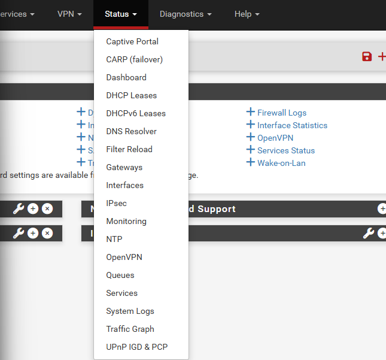

### 5.2. Bật Remote Logging

Kéo xuống phần **Remote Logging Options**:

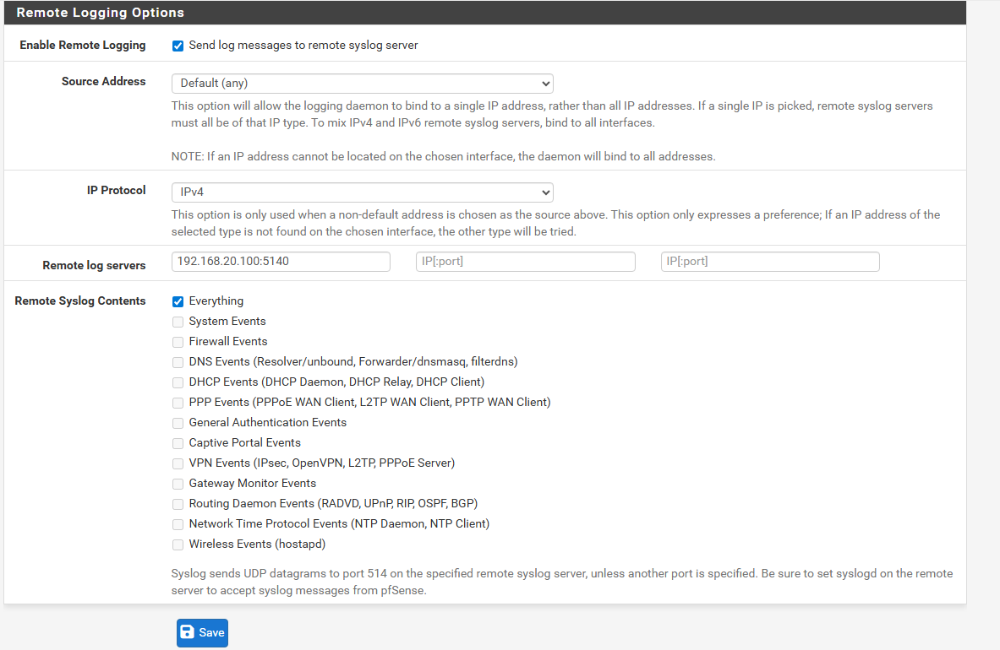

Thiết lập:

- **Enable Remote Logging:** tick vào **Send log messages to remote syslog server**.
- **Source Address:** để mặc định (Any) hoặc chọn LAN.
- **IP Protocol:** IPv4.

### 5.3. Chỉ định địa chỉ Logstash

- **Remote log servers:** nhập IP và port Logstash đã cấu hình:

  ```
  192.168.20.100:5140
  ```

- **Remote Syslog Contents:** trong môi trường lab chọn **Everything** để thu đa dạng loại log (firewall, system, DHCP,...).

Sau khi lưu, pfSense sẽ bắt đầu gửi Syslog về Logstash trên ELK Server.

---

## 6. Triển khai Suricata IDS/IPS và Filebeat (192.168.20.5)

### 6.1. Cài đặt và cấu hình Suricata

```bash
sudo apt update
sudo apt install suricata -y

sudo nano /etc/suricata/suricata.yaml
```

Các cấu hình chính:

```yaml
HOME_NET: "[192.168.20.0/24]"

af-packet:
  - interface: ens33

rule-files:
  # - suricata.rules
  - local.rules
```

Tạo rule tùy chỉnh:

```bash
sudo cat /var/lib/suricata/rules/local.rules
```

Ví dụ rule:

```rules
alert icmp any any -> any any (msg:"[SOS] Phat hien co nguoi Ping trong mang LAN"; sid:1000001; rev:1;)
alert tcp any any -> any any (msg:"[SOC] Canh bao tan cong SQL Injection (UNION SELECT)"; content:"UNION"; nocase; content:"SELECT"; nocase; sid:1000002; rev:1;)
```

Cập nhật rule và khởi động lại dịch vụ:

```bash
sudo suricata-update
sudo systemctl restart suricata
sudo systemctl status suricata
```

### 6.2. Cài đặt Filebeat để đẩy log Suricata về ELK

```bash
sudo apt update
sudo apt install filebeat -y

sudo nano /etc/filebeat/filebeat.yml
```

Cấu hình đọc file `eve.json` của Suricata và gửi về Logstash:

```yaml
filebeat.inputs:
- type: filestream
  id: my-filestream-id
  enabled: true
  paths:
    - /var/log/suricata/eve.json

#output.elasticsearch:
#  hosts: ["localhost:9200"]

output.logstash:
  hosts: ["192.168.20.100:5044"]
```

Khởi động Filebeat:

```bash
sudo systemctl enable filebeat
sudo systemctl restart filebeat
sudo filebeat test output
```

Khi cấu hình đúng, log Suricata sẽ được đẩy vào Elasticsearch qua Logstash và có thể xem trong Kibana.

---

## 7. Cài đặt Winlogbeat trên Domain Controller (192.168.20.10)

### 7.1. Cấu hình output Winlogbeat

Chỉnh file `winlogbeat.yml` để gửi log về Logstash trên ELK Server.

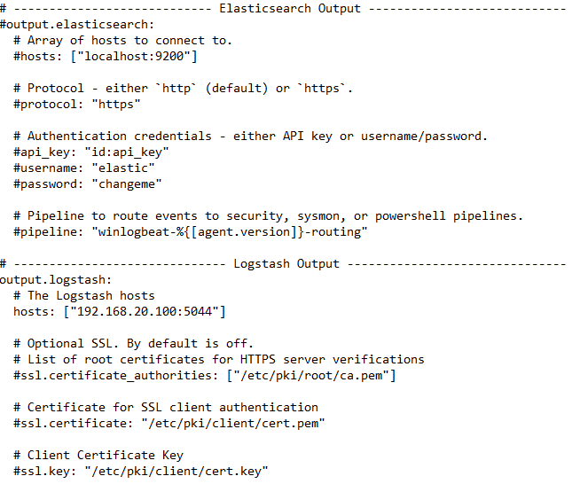

Phần output mẫu:

```yaml
#output.elasticsearch:
#  hosts: ["localhost:9200"]

output.logstash:
  hosts: ["192.168.20.100:5044"]
```

### 7.2. Cài đặt dịch vụ Winlogbeat

Mở PowerShell với quyền Administrator:

```powershell
cd "C:\Program Files\Winlogbeat"
PowerShell.exe -ExecutionPolicy UnRestricted -File .\install-service-winlogbeat.ps1
Start-Service winlogbeat
Get-Service winlogbeat
```

Trạng thái chạy dịch vụ minh họa:

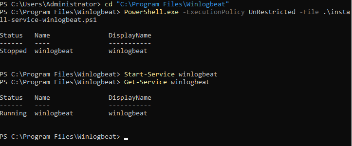

Sau bước này, Event Log Windows (Security, System, Application,...) sẽ được gửi tới Logstash.

---

## 8. Cấu hình Data View và Dashboard trên Kibana

### 8.1. Tạo Data View cho log Windows

1. Trên Kibana, mở menu (3 gạch ngang).
2. Kéo xuống mục **Stack Management**.

   

3. Trong nhóm **Kibana**, chọn **Data Views**.

   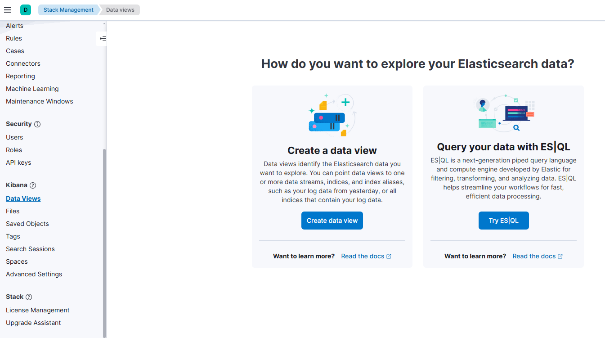

4. Bấm **Create data view**.

   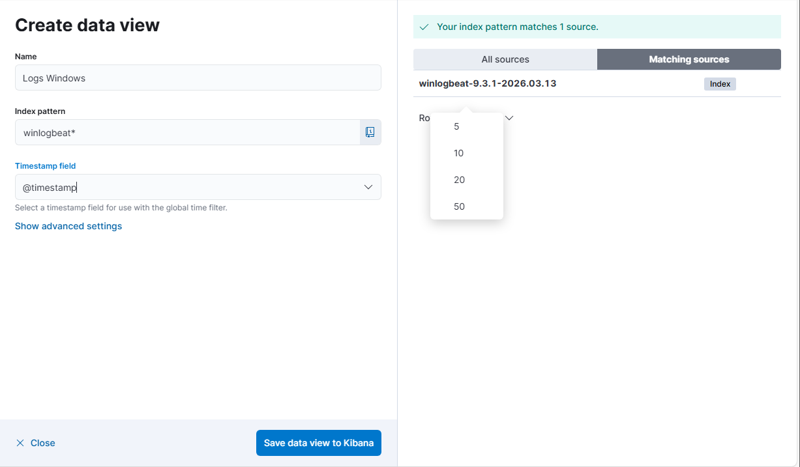

Khai báo thông tin:

- **Name:** `Logs Windows` (tùy ý).
- **Index pattern:** `winlogbeat-*`  (khớp với index Logstash tạo ra).
- Nếu dữ liệu đã vào, Kibana sẽ báo **"Your index pattern matches 1 source"**.
- **Timestamp field:** chọn `@timestamp`.

Bấm **Save data view to Kibana** để lưu.

### 8.2. Tạo Dashboard giám sát brute-force RDP

1. Vào **Dashboard → Create dashboard → Create visualization** để mở Kibana Lens.

   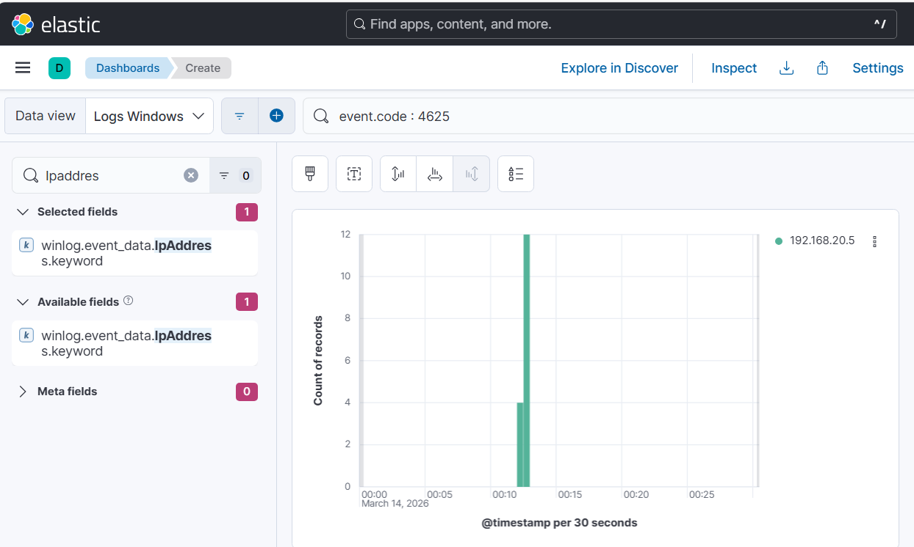

2. Ở thanh search trên cùng, lọc các sự kiện đăng nhập thất bại:

   ```
   event.code: 4625
   ```

3. Đảm bảo khoảng thời gian (Time range) bao phủ lúc bạn chạy tấn công.
4. Kibana mặc định dùng `@timestamp` làm trục X, `Records` làm trục Y.
5. Tìm trường `winlog.event_data.IpAddress` hoặc `winlog.event_data.IpAddress.keyword` trong danh sách fields bên trái và kéo-thả vào khu vực biểu đồ để phân tách theo IP nguồn.
6. Đặt tên biểu đồ, ví dụ **"Giám sát Tấn công RDP (Brute-force)"** và **Save and return**.
7. Lưu toàn bộ Dashboard, ví dụ đặt tên **"SOC Dashboard - Main"**.

Minh họa Dashboard brute-force:

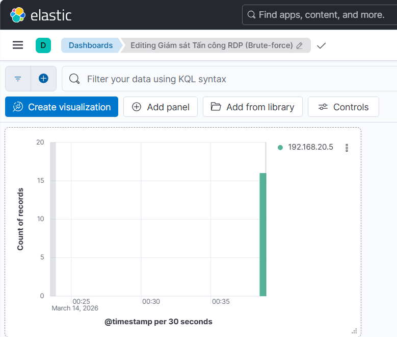

---

## 9. Kịch bản mô phỏng tấn công và quan sát log

### 9.1. Demo 1 – Brute-force RDP vào Domain Controller

**Bước 1 – Tấn công từ máy Attacker**

- Sử dụng công cụ Hydra brute-force giao thức RDP đến WinServer (`192.168.20.10`).
- Ví dụ: cố tình nhập sai mật khẩu **14 lần** với wordlist.

Ảnh minh họa Hydra:

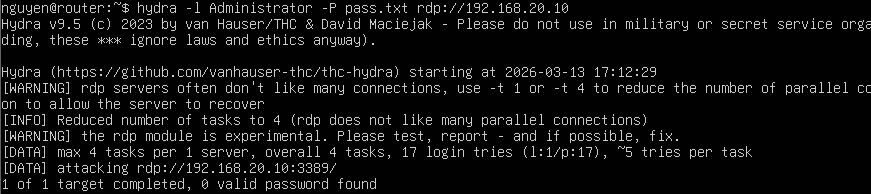

**Bước 2 – Quan sát log trên ELK**

- Trong index Winlogbeat, ta thấy các sự kiện có `event.code: 4625` (Logon failed).
- Các trường quan trọng:
  - `winlog.event_data.LogonType: "3"`
  - `winlog.event_data.TargetUserName: "Administrator"`
  - `winlog.event_data.IpAddress: "192.168.20.5"` (máy Attacker nội bộ).

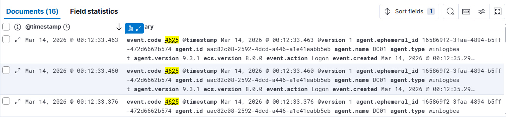

**Bước 3 – Dashboard cảnh báo**

- Trên Dashboard đã tạo ở mục 8.2, cột biểu đồ sẽ nhảy vọt tại thời điểm brute-force.
- Điều này cho phép SOC phát hiện hành vi đăng nhập bất thường theo thời gian gần thực.


### 9.2. Demo 2 – SQL Injection và phát hiện bằng Suricata

**Bước 1 – Gửi payload SQLi**

- Từ máy tấn công, gửi nhiều request có payload dạng `UNION SELECT ...` vào dịch vụ web đích.

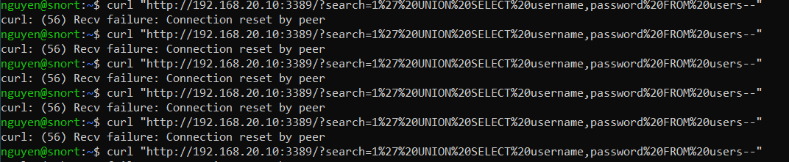

**Bước 2 – Suricata phát hiện tấn công**

- Rule `local.rules` đã cấu hình chuỗi `UNION` và `SELECT` sẽ khớp và sinh alert.

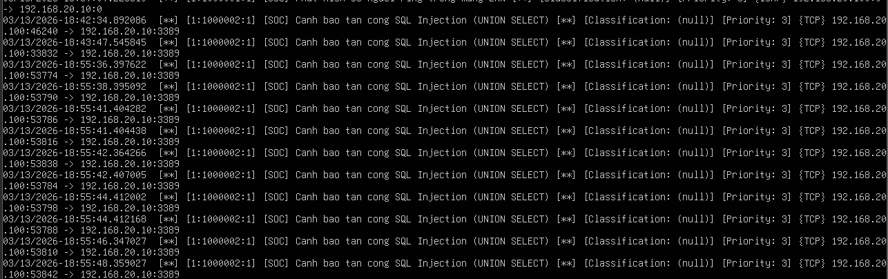

**Bước 3 – Quan sát trên Kibana**

- Log từ `eve.json` được Filebeat đẩy vào ELK.
- Trong Discover/Data View của Suricata, có thể lọc với truy vấn:

  ```
  message: "*SQL*"
  ```

- Thấy các event-type `alert` hiển thị với thông tin nguồn/đích, port, payload,...

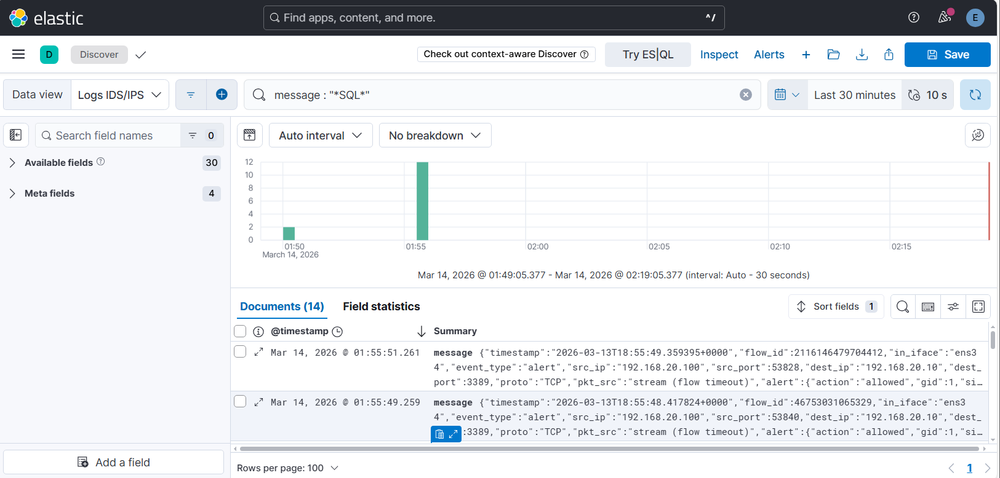

### 9.3. Demo 3 – Scan Nmap vào pfSense

**Bước 1 – Thực hiện Nmap scan**

- Từ máy Attacker, scan interface WAN của pfSense (`192.168.137.133`).

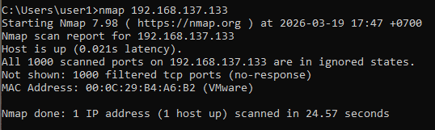

**Bước 2 – Quan sát log tường lửa**

- pfSense gửi log firewall qua Syslog đến Logstash.
- Trên Kibana Dashboard chuyên cho pfSense, có thể thấy:
  - Số lượng gói bị block/pass.
  - Top IP nguồn, giao thức, port đích.

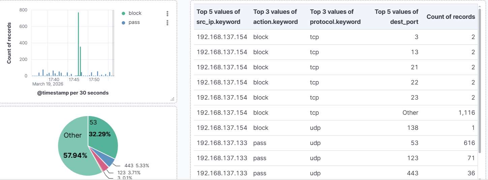

---

## 10. Kết luận và hướng mở rộng

Lab ELK Stack này cung cấp một môi trường hoàn chỉnh để:

- Thực hành thiết kế pipeline thu thập log từ nhiều nguồn khác nhau.
- Hiểu cách điều chỉnh rule IDS (Suricata) và theo dõi kết quả trên ELK.
- Xây dựng Dashboard phục vụ công việc giám sát an toàn thông tin.

Hướng mở rộng:

- Bổ sung parsing chi tiết trong Logstash (sử dụng Grok, mutate, geoip,...).
- Thêm các nguồn log khác: Web server, database, WAF, endpoint agent.
- Tích hợp tính năng Alerting (Rules/Alerts trong Kibana hoặc dùng Elastalert, v.v.).

Tài liệu này có thể dùng như giáo trình lab hoặc baseline để phát triển thành môi trường SOC mini trong doanh nghiệp hoặc phòng lab cá nhân.